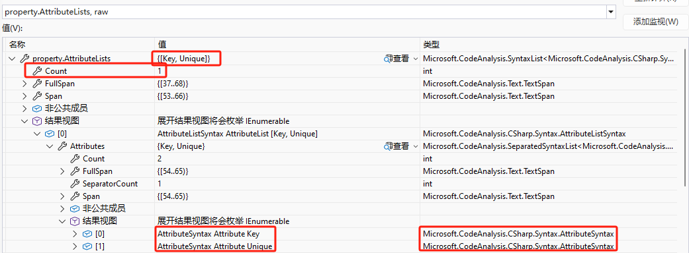
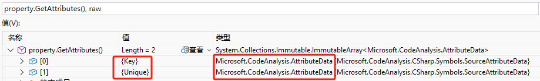

# C# .NET源生成器如何处理Attribute
>* Attribute对.net及源生成器都很重要
>* 可以作为编译参数,影响编译结果
>* 也可以作为源生成器触发条件或参数,影响生成的代码

## 前言
### 1. Attribute很重要
>* 作为元数据描述
>* 作为编译参数,影响编译结果
>* 运行是通过反射读取,影响运行结果
>* 作为源生成器触发条件或参数,影响生成的代码

### 2. SyntaxTree和ISymbol
>* 本文探讨基于SyntaxTree和ISymbol处理Attribute
>* 字符串拼接也可以实现,但不在本文讨论范围

## 一、Attribute解析
### 1. AttributeSyntax
>* AttributeSyntax是Attribute在SyntaxTree中的表现形式

#### 1.1 SyntaxTree中能包含Attribute的对象
>* MemberDeclarationSyntax及其子类(TypeDeclarationSyntax、FieldDeclarationSyntax、PropertyDeclarationSyntax和MethodDeclarationSyntax等)
>* ParameterSyntax

#### 1.2 获取AttributeSyntax的方法
>* 首先遍历Attribute的对象的属性AttributeLists获取AttributeListSyntax
>* 再遍历AttributeListSyntax的属性Attributes

~~~csharp
var source = @"public class Product
    {
        [Key, Unique]
        public int ProductId { get; set; }
        [Unique]
        [StringLength(100, MinimumLength = 6)]
        public string ProductName { get; set; }
    }";
var syntaxTree = CSharpSyntaxTree.ParseText(source);
var properties = syntaxTree.GetRoot().DescendantNodes().OfType<PropertyDeclarationSyntax>();
foreach (var property in properties)
{
    var attributeLists = property.AttributeLists;
    foreach (var attributeList in attributeLists)
    {
        var attributes = attributeList.Attributes;
        foreach (AttributeSyntax attribute in attributes)
        {
            var name = attribute.Name.ToFullString();
            Assert.NotEmpty(name);
        }
        Assert.True(attributes.Any());
    }
    Assert.True(attributeLists.Any());
}
~~~

#### 1.3 获取Attributes效果截图
>

### 2. AttributeData
>* AttributeData是Attribute在ISymbol中的表现形式

#### 2.1 获取AttributeData的方法
>* 通过ISymbol.GetAttributes方法获取AttributeData

~~~csharp
var source = @"public class Product
    {
        [Key, Unique]
        public int ProductId { get; set; }
        [Unique]
        [StringLength(100, MinimumLength = 6)]
        public string ProductName { get; set; }
    }";
var driver = SyntaxTreeDriver.CreateDefaultDriver();
var compilation = driver.Compile(source);
var productType = compilation.GetTypeByMetadataName("Product");
Assert.NotNull(productType);
var properties = SymbolReflection.GetProperties(productType);
foreach (var property in properties)
{
    var attributes = property.GetAttributes();
    foreach (AttributeData attribute in attributes)
    {
        var name = attribute.AttributeClass!.Name;
        Assert.NotEmpty(name);
    }
    Assert.True(attributes.Any());
}
~~~

#### 2.2 获取GetAttributes效果截图
>

### 3. 解析AttributeData
>* 要把AttributeData转化为AttributeSyntax需要先解析AttributeData

#### 3.1 AttributeData由类型和参数构成
>* 类型：AttributeClass
>* 构造函数参数：ConstructorArguments
>* 命名参数：NamedArguments

~~~csharp
class AttributeData
{
    INamedTypeSymbol? AttributeClass { get; }
    ImmutableArray<TypedConstant> ConstructorArguments { get; }
    ImmutableArray<KeyValuePair<string, TypedConstant>> NamedArguments { get; }
}
~~~

#### 3.2 获取TypedConstant
>* 通过SymbolAttributeHelper.GetArgumentConstant方法获取ConstructorArguments
>* 通过SymbolAttributeHelper.GetArgumentConstant方法重载获取NamedArguments

~~~csharp
string sourceCode = @"
    using System;
    namespace ExampleNamespace;

    [AttributeUsage(AttributeTargets.All, AllowMultiple = true)]
    public class MyAttribute : Attribute;
    ";
var compilation = SyntaxTreeDriver.DefaultDriver.Compile(sourceCode);
var type = compilation.GetTypeByMetadataName("ExampleNamespace.MyAttribute");
Assert.NotNull(type);
var attribute = type.GetAttributes().FirstOrDefault();
Assert.NotNull(attribute);
var validOn = SymbolAttributeHelper.GetArgumentConstant(attribute, 0);
Assert.NotNull(validOn);
var allowMultiple = SymbolAttributeHelper.GetArgumentConstant(attribute, "AllowMultiple");
Assert.NotNull(allowMultiple);
~~~

#### 3.3 解析TypedConstant
>* TypedConstant由Kind、Type和Value(Values)组成
>* 其中Kind有5种(Error、Primitive、Enum、Type和Array等)
>* 其中Values只有当Kind为Array时才可用

~~~csharp
class TypedConstant
{
    TypedConstantKind Kind { get; }
    ITypeSymbol? Type { get; }
    object? Value { get; }
    ImmutableArray<TypedConstant> Values { get; }
}
~~~

#### 3.4 把TypedConstant转化为Type
>* 通过GetTypeSymbol把TypedConstant转化为INamedTypeSymbol
>* 只适用Kind为Type
>* 特别注意,源代码中类型是Type,符号获取时转化为INamedTypeSymbol,无法直接获取Type
>* 在源生成器是使用ITypeSymbol(及其子接口)来反射并不直接使用Type

~~~csharp
var sourceCode = @"
    using System;
    namespace ExampleNamespace;

    [AttributeUsage(AttributeTargets.Class)]
    public class MapAttribute(Type from) : Attribute
    {
        public Type From { get; } = from;
    }
    public record Product(int Id, string Name);
    [Map(typeof(Product))]
    public record ProductDto(int ProductId, string ProductName);
    ";
var compilation = SyntaxTreeDriver.DefaultDriver.Compile(sourceCode);
var type = compilation.GetTypeByMetadataName("ExampleNamespace.ProductDto");
Assert.NotNull(type);
var attribute = type.GetAttributes().FirstOrDefault();
Assert.NotNull(attribute);
var constant = SymbolAttributeHelper.GetArgumentConstant(attribute, 0);
Assert.NotNull(constant);
INamedTypeSymbol attributeType = constant.Value.GetTypeSymbol();
Assert.NotNull(attributeType);
~~~

#### 3.5 把TypedConstant转化为枚举
>* 通过GetEnum把TypedConstant转化为枚举
>* 只适用Kind为Enum

~~~csharp
var sourceCode = @"
    using System;

    namespace ExampleNamespace;

    [AttributeUsage(AttributeTargets.All)]
    public class MyAttribute : Attribute;
    ";
var compilation = SyntaxTreeDriver.DefaultDriver.Compile(sourceCode);
var type = compilation.GetTypeByMetadataName("ExampleNamespace.MyAttribute");
Assert.NotNull(type);
var attribute = type.GetAttributes().FirstOrDefault();
Assert.NotNull(attribute);
var validOn = SymbolAttributeHelper.GetArgumentConstant(attribute, 0);
Assert.NotNull(validOn);
var targets = validOn.Value.GetEnum<AttributeTargets>();
Assert.Equal(AttributeTargets.All, targets);
~~~

#### 3.6 把TypedConstant转化为常量原始值
>* 通过GetPrimitive把TypedConstant转化为常量原始值
>* 只适用Kind为Primitive

~~~csharp
var sourceCode = @"
    using System;
    using System.ComponentModel.DataAnnotations.Schema;

    namespace ExampleNamespace;

    [Table(""Products"")]
    public record Product(int ProductId, string ProductName);
    ";
var compilation = SyntaxTreeDriver.CreateDefaultDriver()
    .Reference<TableAttribute>()
    .Compile(sourceCode);
var type = compilation.GetTypeByMetadataName("ExampleNamespace.Product");
Assert.NotNull(type);
var attribute = type.GetAttributes().FirstOrDefault();
Assert.NotNull(attribute);
var constant = SymbolAttributeHelper.GetArgumentConstant(attribute, 0);
Assert.NotNull(constant);
var value = constant.Value.GetPrimitive<string>();
Assert.Equal("Products", value);
~~~

#### 3.7 把TypedConstant转化为数组
>* 通过GetValues把TypedConstant转化为数组
>* 只适用Kind为Array

~~~csharp
var sourceCode = @"
    using System;
    namespace ExampleNamespace;

    [AttributeUsage(AttributeTargets.Class)]
    public class RecognizeAttribute : Attribute
    {
        public string[] Rules { get; set; } = [];
    }
    public record Product(int Id, string Name);
    [Recognize(Rules = [""Id:ProductId"", ""Name:ProductName""])]
    public record ProductDto(int ProductId, string ProductName);
    ";
var compilation = SyntaxTreeDriver.DefaultDriver.Compile(sourceCode);
var type = compilation.GetTypeByMetadataName("ExampleNamespace.ProductDto");
Assert.NotNull(type);
var attribute = type.GetAttributes().FirstOrDefault();
Assert.NotNull(attribute);
var constant = SymbolAttributeHelper.GetArgumentConstant(attribute, "Rules");
Assert.NotNull(constant);
var values = constant.Value.GetValues<string>();
Assert.Equal(["Id:ProductId", "Name:ProductName"], values);
~~~

#### 3.7 把TypedConstant转化为配置值
>* 通过GetValue把TypedConstant转化为配置值
>* GetValue可以代替前面四种方法
>* 如果能确定Kind类型还是建议使用对应的专职方法
>* GetValue实际封装了前面4个方法,按Kind类型调用,性能会有损耗

~~~csharp
var sourceCode = @"
    using System;
    namespace ExampleNamespace;

    [AttributeUsage(AttributeTargets.All)]
    public class MyAttribute : Attribute;
    ";
var compilation = SyntaxTreeDriver.DefaultDriver.Compile(sourceCode);
var type = compilation.GetTypeByMetadataName("ExampleNamespace.MyAttribute");
Assert.NotNull(type);
var attribute = type.GetAttributes().FirstOrDefault();
Assert.NotNull(attribute);
var constant = SymbolAttributeHelper.GetArgumentConstant(attribute, 0);
Assert.NotNull(constant);
var value = constant.Value.GetValue<AttributeTargets>();
Assert.Equal(AttributeTargets.All, value);
~~~

#### 3.8 泛型Attribute类型参数
>* 通过AttributeClass获取Attribute实际类型
>* 通过TypeArguments获取泛型参数

~~~csharp
var sourceCode = @"
    using System;

    namespace ExampleNamespace;

    [AttributeUsage(AttributeTargets.Struct | AttributeTargets.Class)]
    public class MapAttribute<TFrom> : Attribute
    {
        public Type From { get; } = typeof(TFrom);
    }
    public readonly record struct User(string Name);
    [Map<User>]
    public partial class UserDTO;
    ";
var compilation = SyntaxTreeDriver.DefaultDriver.Compile(sourceCode);
var syntaxTree = compilation.SyntaxTrees.FirstOrDefault();
Assert.NotNull(syntaxTree);
var classDeclaration = syntaxTree.GetRoot().DescendantNodes().OfType<ClassDeclarationSyntax>().LastOrDefault();
Assert.NotNull(classDeclaration);
var semanticModel = compilation.GetSemanticModel(syntaxTree);
var symbol = semanticModel.GetDeclaredSymbol(classDeclaration);
Assert.NotNull(symbol);
var attributeData = symbol.GetAttributes().FirstOrDefault();
Assert.NotNull(attributeData);
var attributeClass = attributeData.AttributeClass;
Assert.NotNull(attributeClass);
var attributeTypeArgument = attributeClass.TypeArguments.FirstOrDefault();
Assert.NotNull(attributeTypeArgument);
~~~

### 4 判断是否包含指定Attribute
>* 判断Attribute,存在是触发源生成器或其他逻辑的常用方式

#### 4.1 判断非泛型Attribute
>* 通过GetTypeByMetadataName获取指定的Attribute类型
>* 通过Equals判断类型是否一致

~~~csharp
var sourceCode = @"
    using System;

    namespace ExampleNamespace;

    [MyAttribute]
    public class MyClass;
    [AttributeUsage(AttributeTargets.All, AllowMultiple = true)]
    public class MyAttribute : Attribute;
    ";
var compilation = SyntaxTreeDriver.DefaultDriver.Compile(sourceCode);
var attributeSymbol = compilation.GetTypeByMetadataName("ExampleNamespace.MyAttribute");
Assert.NotNull(attributeSymbol);
var syntaxTree = compilation.SyntaxTrees.FirstOrDefault();
Assert.NotNull(syntaxTree);
var classDeclaration = syntaxTree.GetRoot().DescendantNodes().OfType<ClassDeclarationSyntax>().FirstOrDefault();
Assert.NotNull(classDeclaration);
var semanticModel = compilation.GetSemanticModel(syntaxTree);
var symbol = semanticModel.GetDeclaredSymbol(classDeclaration);
Assert.NotNull(symbol);
var attributeData = symbol.GetAttributes().FirstOrDefault();
Assert.NotNull(attributeData);
Assert.True(attributeSymbol.Equals(attributeData.AttributeClass, SymbolEqualityComparer.Default));
~~~

#### 4.2 判断泛型Attribute
>* 通过GetTypeByMetadataName获取指定的Attribute类型也支持泛型
>* 通过扩展方法IsGenericType判断是否为泛型

~~~csharp
var sourceCode = @"
    using System;

    namespace ExampleNamespace;

    [AttributeUsage(AttributeTargets.Struct | AttributeTargets.Class)]
    public class MapAttribute<TFrom> : Attribute
    {
        public Type From { get; } = typeof(TFrom);
    }
    public readonly record struct User(string Name);
    [Map<User>]
    public partial class UserDTO;
    ";
var compilation = SyntaxTreeDriver.DefaultDriver.Compile(sourceCode);
var attributeSymbol = compilation.GetTypeByMetadataName("ExampleNamespace.MapAttribute`1");
Assert.NotNull(attributeSymbol);
var syntaxTree = compilation.SyntaxTrees.FirstOrDefault();
Assert.NotNull(syntaxTree);
var classDeclaration = syntaxTree.GetRoot().DescendantNodes().OfType<ClassDeclarationSyntax>().LastOrDefault();
Assert.NotNull(classDeclaration);
var semanticModel = compilation.GetSemanticModel(syntaxTree);
var symbol = semanticModel.GetDeclaredSymbol(classDeclaration);
Assert.NotNull(symbol);
var attributeData = symbol.GetAttributes().FirstOrDefault();
Assert.NotNull(attributeData);
var attributeClass = attributeData.AttributeClass;
Assert.NotNull(attributeClass);
Assert.True(attributeClass.IsGenericType(attributeSymbol));
~~~

#### 4.3 Attribute通用判断
>* 通过GetTypeByMetadataName获取指定的泛型Attribute
>* 通过SymbolAttributeHelper.GetAttributesByType方法获取Attribute支持泛型

~~~csharp
var sourceCode = @"
    using System;

    namespace ExampleNamespace;

    [AttributeUsage(AttributeTargets.Struct | AttributeTargets.Class)]
    public class MapAttribute(Type from) : Attribute
    {
        public Type From { get; } = from;
    }
    [AttributeUsage(AttributeTargets.Struct | AttributeTargets.Class)]
    public class MapAttribute<TFrom> : Attribute
    {
        public Type From { get; } = typeof(TFrom);
    }
    public readonly record struct User(string Name);
    [Map<User>]
    [Map(typeof(User))]
    public partial class UserDTO;
    ";
var compilation = SyntaxTreeDriver.DefaultDriver.Compile(sourceCode);
var attributeSymbol = compilation.GetTypeByMetadataName("ExampleNamespace.MapAttribute");
Assert.NotNull(attributeSymbol);
var attributeGenericSymbol = compilation.GetTypeByMetadataName("ExampleNamespace.MapAttribute`1");
Assert.NotNull(attributeGenericSymbol);
var syntaxTree = compilation.SyntaxTrees.FirstOrDefault();
Assert.NotNull(syntaxTree);
var classDeclaration = syntaxTree.GetRoot().DescendantNodes().OfType<ClassDeclarationSyntax>().LastOrDefault();
Assert.NotNull(classDeclaration);
var semanticModel = compilation.GetSemanticModel(syntaxTree);
var symbol = semanticModel.GetDeclaredSymbol(classDeclaration);
Assert.NotNull(symbol);
var attributeData = SymbolAttributeHelper.GetAttributesByType(symbol, attributeSymbol)
    .FirstOrDefault();
Assert.NotNull(attributeData);
var attributeGenericData = SymbolAttributeHelper.GetAttributesByType(symbol, attributeGenericSymbol)
    .FirstOrDefault();
Assert.NotNull(attributeGenericData);
~~~

## 二、生成Attribute
### 1. 生成AttributeSyntax
>* 通过方法SyntaxFactory.Attribute构造AttributeSyntax

#### 1.1 无参的Attribute
~~~csharp
var attribute = SyntaxFactory.Attribute(SyntaxFactory.IdentifierName("Fact"));
var code = attribute.ToFullString();
Assert.Equal("Fact", code);
~~~

#### 1.2 使用构造函数参数
>* 通过SyntaxFactory.AttributeArgument方法构造Attribute的参数

~~~csharp
var attributeName = SyntaxFactory.IdentifierName("InlineData");
var argument = SyntaxFactory.AttributeArgument(SyntaxGenerator.Literal(1));
var attribute = attributeName.Attribute([argument]);
var code = attribute.ToFullString();
Assert.Equal("InlineData(1)", code);
~~~

#### 1.3 使用命名参数
>* 使用ToAttributeArgument扩展方法构造Attribute的参数
>* 使用ToAttributeArgument扩展方法重载构造Attribute的命名参数

~~~csharp
var attributeName = SyntaxFactory.IdentifierName("AttributeUsage");
var targets = SyntaxFactory.IdentifierName("AttributeTargets").
    Access("Method");
var inherited = SyntaxGenerator.FalseLiteral;
var attribute = attributeName.Attribute([
    targets.ToAttributeArgument(), 
    inherited.ToAttributeArgument("Inherited")]);
var code = attribute.NormalizeWhitespace().ToFullString();
Assert.Equal("AttributeUsage(AttributeTargets.Method, Inherited = false)", code);
~~~

### 2. 把AttributeSyntax附加到SyntaxTree
>* 使用ToSingletonList把AttributeSyntax转化为独立的AttributeListSyntax
>* 还可以用SyntaxFactory.AttributeList合并多个AttributeListSyntax
>* 使用AddAttributeLists方法附加AttributeSyntax

~~~csharp
var attribute = SyntaxFactory.IdentifierName("Fact").Attribute();
var method = SyntaxGenerator.VoidType.Method("Simple")
    .WithBody(SyntaxFactory.Block())
    .AddAttributeLists(attribute.ToSingletonList());
var code = method.NormalizeWhitespace().ToFullString();
Assert.Contains("[Fact]", code);
~~~

### 3. 判断AttributeData是否适合当前节点
>* 该场景是把ISymbol的AttributeData附加到SyntaxTree之前先验证是否适用
>* 由于Attribute有ValidOn属性,不符合编译会报错

#### 3.1 只判断AttributeTargets
>* AttributeSymbolCacher用于缓存Attribute的类型信息,避免相同类型重复解析
>* 以下示例为由结构体User生成类UserDTO,尝试把MyAttribute复制过去
>* 通过VerifyTarget验证原Attribute是否能用于类UserDTO
>* 由于MyAttribute只能用于结构体,所以MyAttribute无法复制到UserDTO

~~~csharp
var sourceCode = @"
    using System;

    [AttributeUsage(AttributeTargets.Struct)]
    public class MyAttribute : Attribute;
    [MyAttribute]
    public readonly record struct User(string Name);
    public partial class UserDTO;
    ";
var compilation = SyntaxTreeDriver.DefaultDriver.Compile(sourceCode);
var sourceType = compilation.GetTypeByMetadataName("User");
Assert.NotNull(sourceType);
var attribute = sourceType.GetAttributes().FirstOrDefault();
Assert.NotNull(attribute);
var destType = compilation.GetTypeByMetadataName("UserDTO");
Assert.NotNull(destType);
var attributeCacher = new AttributeSymbolCacher(compilation);
Assert.False(attributeCacher.VerifyTarget(AttributeTargets.Class, attribute));
~~~

#### 3.2 判断AttributeTarget及与目标是否冲突
>* AttributeSymbolCacher用于缓存Attribute的类型信息,避免相同类型重复解析
>* 以下示例为由结构体User生成类UserDTO,尝试把MyAttribute复制过去
>* 通过Verify验证原Attribute是否能用于类UserDTO及是否冲突
>* 虽然MyAttribute也可用于类,但UserDTO已经有一个MyAttribute,所以还是无法复制到UserDTO
>* Verify还有属性、字段、函数和参数的重载,这些都类似,就不重复举例了

~~~csharp
var sourceCode = @"
    using System;

    [AttributeUsage(AttributeTargets.Struct | AttributeTargets.Class, AllowMultiple = false))]
    public class MyAttribute : Attribute;
    [MyAttribute]
    public readonly record struct User(string Name);
    [MyAttribute]
    public partial class UserDTO;
    ";
var compilation = SyntaxTreeDriver.DefaultDriver.Compile(sourceCode);
var sourceType = compilation.GetTypeByMetadataName("User");
Assert.NotNull(sourceType);
var attribute = sourceType.GetAttributes().FirstOrDefault();
Assert.NotNull(attribute);
var destType = compilation.GetTypeByMetadataName("UserDTO");
Assert.NotNull(destType);
var attributeCacher = new AttributeSymbolCacher(compilation);
Assert.False(attributeCacher.Verify(destType, attribute));
~~~

### 4. 把AttributeData转化为AttributeSyntax
>* 通过ToSyntax扩展方法把AttributeData转化为AttributeSyntax
>* namespaces是生成AttributeSyntax需要添加的命名空间
>* 如果把生成的AttributeSyntax附加到SyntaxTree,namespaces也需要同步添加

~~~csharp
var sourceCode = @"
    using System;
    namespace GenerateCoreTests;

    [AttributeUsage(AttributeTargets.Struct | AttributeTargets.Class))]
    public class MyAttribute(int value) : Attribute
    {
        public int Value { get; } = value;
    }
    [My(3)]
    public readonly record struct User(string Name);
    public partial class UserDTO;
    ";
var compilation = SyntaxTreeDriver.DefaultDriver.Compile(sourceCode);
var sourceType = compilation.GetTypeByMetadataName("GenerateCoreTests.User");
Assert.NotNull(sourceType);
AttributeData? attribute = sourceType.GetAttributes().FirstOrDefault();
Assert.NotNull(attribute);
List<string> namespaces = [];
AttributeSyntax attributeSyntax = attribute.ToSyntax(namespaces);
var code = attributeSyntax.ToFullString();
Assert.Equal("My(3)", code);
Assert.Single(namespaces);
Assert.Equal("GenerateCoreTests", namespaces[0]);
~~~

### 5. 演示完整的Attribute操作

#### 5.1 源生成流程的Case
>* 通过GetSemanticModel方法获取模型
>* 通过GetDeclaredSymbol方法解析当前类型符号
>* 通过GetTypeByMetadataName方法获取Attribute泛型
>* 判断当前类型符号是否包含指定Attribute及源类型
>* 通过SymbolReflection.GetConstructors方法获取源类型构造函数
>* 通过源类型构造函数获取源类型参数
>* 获取源类型参数的Attribute并调用ToSyntax扩展方法转化为AttributeSyntax
>* 按源类型参数构造目标类型属性并添加AttributeSyntax

~~~csharp
var sourceCode = @"
    using System;
    using System.ComponentModel.DataAnnotations;
    using System.ComponentModel.DataAnnotations.Schema;

    namespace ExampleNamespace;

    [AttributeUsage(AttributeTargets.Struct | AttributeTargets.Class)]
    public class MapAttribute<TFrom> : Attribute
    {
        public Type From { get; } = typeof(TFrom);
    }
    public readonly record struct User([StringLength(100)]string Name);
    [Map<User>]
    public partial class UserDTO;
    ";
var compilation = SyntaxTreeDriver.DefaultDriver.Compile(sourceCode);
var syntaxTree = compilation.SyntaxTrees.FirstOrDefault();
Assert.NotNull(syntaxTree);
var classDeclaration = syntaxTree.GetRoot().DescendantNodes().OfType<ClassDeclarationSyntax>().LastOrDefault();
Assert.NotNull(classDeclaration);
var semanticModel = compilation.GetSemanticModel(syntaxTree);
var symbol = semanticModel.GetDeclaredSymbol(classDeclaration);
Assert.NotNull(symbol);
var attributeSymbol = compilation.GetTypeByMetadataName("ExampleNamespace.MapAttribute`1");
Assert.NotNull(attributeSymbol);
var attributeData = SymbolAttributeHelper.GetAttributesByType(symbol, attributeSymbol)
    .FirstOrDefault();
Assert.NotNull(attributeData);
var attributeClass = attributeData.AttributeClass;
Assert.NotNull(attributeClass);
var sourceSymbol = attributeClass.TypeArguments.FirstOrDefault() as INamedTypeSymbol;
Assert.NotNull(sourceSymbol);
var constructor = SymbolReflection.GetConstructors(sourceSymbol)
    .FirstOrDefault();
Assert.NotNull(constructor);
var parameterSymbol = constructor.Parameters.FirstOrDefault();
Assert.NotNull(parameterSymbol);
var attributeCacher = new AttributeSymbolCacher(compilation);
var attribute = attributeCacher.GetAttributes(parameterSymbol, AttributeTargets.Property)
    .FirstOrDefault();
Assert.NotNull(attribute);
var attributeNamespaces = new List<string>();
var attributeSyntax = attribute.ToSyntax(attributeNamespaces);
var attributeNamespace = attributeNamespaces.FirstOrDefault();
Assert.NotNull(attributeNamespace);
var propertyType = parameterSymbol.Type.ToSyntax();
var property = propertyType.GetSetProperty(parameterSymbol.Name)
    .Public()
    .AddAttributeLists(attributeSyntax.ToSingletonList());
var type = SyntaxFactory.ClassDeclaration(classDeclaration.Identifier)
    .WithModifiers(classDeclaration.Modifiers)
    .AddMembers(property);
var @namespace = SyntaxFactory.NamespaceDeclaration(SyntaxFactory.IdentifierName(symbol.ContainingNamespace.Name))
    .AddUsings(SyntaxFactory.UsingDirective(SyntaxFactory.IdentifierName(attributeNamespace)))
    .AddMembers(type);
var code = @namespace.NormalizeWhitespace().ToFullString();
Assert.Contains("[StringLength(100)]", code);
~~~

#### 5.2 生成的代码
>* 原类型Name参数的Attribute被完美的复制到目标类Name属性上

~~~csharp
namespace ExampleNamespace
{
    using System.ComponentModel.DataAnnotations;

    public partial class UserDTO
    {
        [StringLength(100)]
        public string Name { get; set; }
    }
}
~~~

## 三、实现说明
### 1. 示例执行说明
>* 以上代码执行依赖开源项目EasySyntax、Hand.GenerateCore和Hand.Generators.SyntaxScripting,nuget包如下
>* Hand.Generators.EasySyntax --version 0.2.1.4
>* Hand.GenerateCore --version 0.2.1.6
>* Hand.Generators.SyntaxScripting --version 0.2.1.4-alpha

### 2. 示例代码及开源源码
>* 源码托管地址: https://github.com/donetsoftwork/Hand.Generators ，欢迎大家直接查看源码。
>* gitee同步更新:https://gitee.com/donetsoftwork/hand.-generators

如果大家喜欢请动动您发财的小手手帮忙点一下Star,谢谢！！！