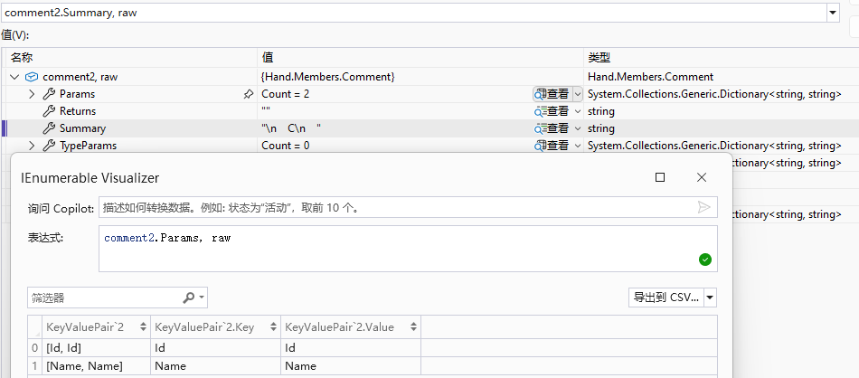

# C#.NET源生成器如何处理XML注释文档
>* XML注释文档是.net代码很重要部分。Roslyn提供了处理 XML注释文档的 API。提供了按文档生成代码及生成含文档的代码便利性。

## 1. 前言
### 1.1 Roslyn支持XML注释文档
>* Roslyn支持从ISymbol获取XML注释文档
>* Roslyn支持从SyntaxTree节点获取XML注释文档
>* Roslyn支持对SyntaxTree节点添加XML注释文档

### 1.2 源生成器需要生成XML注释文档
>* XML注释文档是源代码很重要的一部分
>* 可用于代码提示
>* 用于提高代码可读性
>* 用于生成API文档
>* 如果源生成器不支持XML注释文档,大多只能停留在demo层面用于装十三

## 2. 注释
### 2.1 单行注释
>* 单行注释

~~~csharp
SyntaxTrivia comment = SyntaxFactory.Comment("// singleLine Comment");
Assert.True(comment.IsKind(SyntaxKind.SingleLineCommentTrivia));
~~~

## 2.2 多行注释

~~~csharp
SyntaxTrivia comment = SyntaxFactory.Comment("/* MultiLine\r\n Comment */");
Assert.True(comment.IsKind(SyntaxKind.MultiLineCommentTrivia));
~~~

## 3. XmlElementSyntax
>* XmlElementSyntax是构成 XML文档注释的核心部分之一

### 3.1 XmlElementSyntax定义
>* 由开始标签(StartTag)、子元素(Content)和结束标签(EndTag)组成
>* 是个标准的XML结构

~~~csharp
class XmlElementSyntax : XmlNodeSyntax
{
    XmlElementStartTagSyntax StartTag { get; }
    SyntaxList<XmlNodeSyntax> Content { get; }
    XmlElementEndTagSyntax EndTag { get; }
}
~~~

### 3.2 XmlElementSyntax简单的Case
>* 通过 SyntaxFactory.XmlElement方法构造 XmlElementSyntax

~~~csharp
SyntaxList<XmlNodeSyntax> content = [SyntaxFactory.XmlText("用户名")];
XmlElementSyntax summary = SyntaxFactory.XmlElement("summary", content);
Assert.Equal("
", summary.StartTag.ToFullString());
Assert.Equal("
", summary.EndTag.ToFullString());
Assert.Equal("
用户名
", summary.ToFullString());
~~~

## 4. XmlNameAttributeSyntax
>* XmlNameAttributeSyntax是表示 XML文档中的属性主要的类之一
>* XmlAttributeSyntax是属性的抽象基类

### 4.1 XmlNameAttributeSyntax定义
>* 由属性名(Name)、等号(EqualsToken)、引号(StartQuoteToken和EndQuoteToken)和属性值(Identifier)组成

~~~csharp
class XmlNameAttributeSyntax : XmlAttributeSyntax
{
    XmlNameSyntax Name { get; }
    SyntaxToken EqualsToken { get; }
    SyntaxToken StartQuoteToken { get; }
    IdentifierNameSyntax Identifier { get; }
    SyntaxToken EndQuoteToken { get; }
}
~~~

### 4.2 XmlNameAttributeSyntax的Case
>* 使用SyntaxFactory.XmlNameAttribute方法构造XmlNameAttributeSyntax

~~~csharp
XmlNameAttributeSyntax attribute = SyntaxFactory.XmlNameAttribute("id");
Assert.Equal(" name=\"id\"", attribute.ToFullString());
~~~

### 4.3 XmlNameAttributeSyntax结合XmlElementSyntax的Case
>* XmlNameAttributeSyntax一般都是结合XmlElementSyntax来使用的
>* XmlElementSyntax通过StartTag的AddAttributes方法添加属性

~~~csharp
SyntaxList<XmlNodeSyntax> content = [SyntaxFactory.XmlText("用户")];
XmlElementSyntax element = SyntaxFactory.XmlElement("param", content);
XmlNameAttributeSyntax attribute = SyntaxFactory.XmlNameAttribute("userId");
element = element.WithStartTag(element.StartTag.AddAttributes(attribute));
Assert.Equal("<param name=\"userId\">", element.StartTag.ToFullString());
Assert.Equal("</param>", element.EndTag.ToFullString());
Assert.Equal("<param name=\"userId\">用户</param>", element.ToFullString());
~~~

## 5. XML注释文档
>* XML注释文档是单行注释

### 5.1 DocumentationCommentTriviaSyntax
>* DocumentationCommentTriviaSyntax是用于表示XML注释文档的类
>* DocumentationCommentTriviaSyntax主要是包含子元素(Content)

~~~csharp
class DocumentationCommentTriviaSyntax : StructuredTriviaSyntax
{
    SyntaxList<XmlNodeSyntax> Content { get; }
}
~~~

### 5.2 Summary注释简单的Case
>* 调用SyntaxFactory.XmlSummaryElement方法生成XmlElementSyntax
>* SyntaxFactory.XmlSummaryElement方法是对上面SyntaxFactory.XmlElement方法的封装
>* 调用SyntaxGenerator.CreateDocumentation生成

~~~csharp
SyntaxList<XmlNodeSyntax> context = [SyntaxFactory.XmlText("用户名")];
XmlElementSyntax summary = SyntaxFactory.XmlSummaryElement(context);
Assert.Equal("
", summary.StartTag.ToFullString());
Assert.Equal("
", summary.EndTag.ToFullString());
Assert.Equal("
用户名
", summary.ToFullString());
DocumentationCommentTriviaSyntax documentation = SyntaxGenerator.CreateDocumentation(summary);
Assert.True(documentation.IsKind(SyntaxKind.SingleLineDocumentationCommentTrivia));
Assert.Equal("/// 
用户名
\r\n", documentation.ToFullString());
~~~

### 5.3 大部分XML注释文档有换行
>* 换行XML注释文档如下
>* 这样的XML注释文档也是可以实现的

~~~text
/// 

/// 用户名
/// 

~~~

### 5.4 Summary换行注释的Case
>* context对比4.2前后多了XmlNewLine(true)

~~~csharp
SyntaxList<XmlNodeSyntax> context = [XmlNewLine(true), SyntaxFactory.XmlText("用户名"), XmlNewLine(true)];
XmlElementSyntax summary = SyntaxFactory.XmlSummaryElement(context);
Assert.Equal("
", summary.StartTag.ToFullString());
Assert.Equal("
", summary.EndTag.ToFullString());
Assert.Equal("
\r\n/// 用户名\r\n/// 
", summary.ToFullString());
DocumentationCommentTriviaSyntax documentation = SyntaxGenerator.CreateDocumentation(summary);
Assert.True(documentation.IsKind(SyntaxKind.SingleLineDocumentationCommentTrivia));
Assert.Equal("/// 
\r\n/// 用户名\r\n/// 
\r\n", documentation.ToFullString());

static XmlTextSyntax XmlNewLine(bool continueComment)
    => SyntaxFactory.XmlText(SyntaxFactory.XmlTextNewLine("\r\n", continueComment));
~~~

## 6. 复杂XML注释文档
### 6.1 含复杂XML注释文档的代码的Case
>* EntityKey类的XML注释文档含summary、typeparam和param
>* 其中typeparam和param还都含name属性

~~~csharp
/// 

/// 实体主键
/// 

/// <typeparam name="TKey">主键类型</typeparam>
/// <param name="key">主键</param>
public class EntityKey<TKey>(TKey key)
{
    /// 

    /// 主键
    /// 

    public TKey Key { get; } = key;
}
~~~

### 6.2 使用Roslyn生成EntityKey类的XML注释文档
>* 构造summary、typeparam和paramd等3个XmlElementSyntax
>* 使用换行符line分割3个XmlElementSyntax及XmlNewLine(false)作为documentation的子元素
>* 调用SyntaxFactory.DocumentationComment构造XML注释文档

~~~csharp
var line = XmlNewLine(true);
XmlElementSyntax summary = XmlSummary("实体主键", separator);
XmlElementSyntax typeparam = NamedXmlElement("typeparam", "TKey", "主键类型");
XmlElementSyntax param = NamedXmlElement("param", "key", "主键");
XmlNodeSyntax[] content = [summary, separator, typeparam, separator, param, XmlNewLine(false)];
DocumentationCommentTriviaSyntax documentation = SyntaxFactory.DocumentationComment(content);
var code = documentation.ToFullString();
Assert.Contains("
", code);

static XmlElementSyntax NamedXmlElement(string elementName, string name, string text)
{
    SyntaxList<XmlNodeSyntax> content = [SyntaxFactory.XmlText(text)];
    XmlElementSyntax element = SyntaxFactory.XmlElement(elementName, content);
    XmlNameAttributeSyntax attribute = SyntaxFactory.XmlNameAttribute(name);
    return element.WithStartTag(element.StartTag.AddAttributes(attribute));
}
static XmlElementSyntax XmlSummary(string summary, XmlTextSyntax line)
{
    SyntaxList<XmlNodeSyntax> summaryContext = [line, SyntaxFactory.XmlText(summary), line];
    return SyntaxFactory.XmlSummaryElement(summaryContext);
}
static XmlTextSyntax XmlNewLine(bool continueComment)
    => SyntaxFactory.XmlText(SyntaxFactory.XmlTextNewLine("\r\n", continueComment));
~~~

### 6.3 以上代码生成的XML注释文档
>* 生成的XML注释文档与源代码中的还原度为100%

~~~text
/// 

/// 实体主键
/// 

/// <typeparam name="TKey">主键类型</typeparam>
/// <param name="key">主键</param>
~~~

### 6.4 生成复杂XML注释文档更通用的方法
>* 先构造Comment对象
>* Comment支持Summary、多个TypeParams、多个Params及Returns
>* 调用SyntaxGenerator.CreateDocumentation生成XML注释文档
>* 该示例生成结果与5.2完全一致

~~~csharp
var comment = new Comment() 
{
    Summary = "实体主键",
    TypeParams = { { "TKey", "主键类型" } },
    Params = { { "key", "主键" } }
};
DocumentationCommentTriviaSyntax? documentation = SyntaxGenerator.CreateDocumentation(comment);
Assert.NotNull(documentation);
var code = documentation.ToFullString();
Assert.Contains("
", code);
~~~

## 7. 单行注释生成XML注释文档
>* 单行注释生成XML注释文档是可行的
>* 但是不推荐

### 7.1 单行注释生成XML注释文档的Case
>* SyntaxFactory.Comment生成单行注释
>* 这种方式生成复杂文档大概率、需要大量字符串拼接

~~~csharp
SyntaxTrivia comment = SyntaxFactory.Comment("/// 
This is  comment
");
var method = SyntaxGenerator.VoidType.Method("Test")
    .WithBody(SyntaxFactory.Block())
    .WithLeadingTrivia(comment);
var code = method.ToFullString();
Assert.Contains("
", code);
~~~

### 7.2 生成的代码如下
~~~csharp
/// 
This is  comment

void Test()
{
}
~~~

## 8. 从ISymbol解析XML注释文档
### 8.1 读取XML注释文档
>* 通过方法GetDocumentationCommentXml读取XML注释文档

~~~csharp
var sourceCode = @"
    /// 

    /// C
    /// 

    /// <param name=""Id"">Id</param>
    /// <param name=""Name"">Name</param>
    record C(int Id, string Name);";
var compilation = SyntaxTreeDriver.CreateDefaultDriver()
    .Compile(sourceCode);
INamedTypeSymbol? classSymbol = compilation.GetTypeByMetadataName("C");
Assert.NotNull(classSymbol);
string? xml = classSymbol.GetDocumentationCommentXml();
Assert.NotNull(xml);
~~~

### 8.2 读取XML注释文档的结果
>* 结果是一个完整的XML节点member

~~~xml
<member name="T:C">
    

    C
    

    <param name="Id">Id</param>
    <param name="Name">Name</param>
</member>
~~~

### 8.3 解析XML注释文档
>* CommentParser.GetSummary解析Summary
>* CommentParser.Comment解析Summary及参数

~~~csharp
var sourceCode = @"
    /// 

    /// C
    /// 

    /// <param name=""Id"">Id</param>
    /// <param name=""Name"">Name</param>
    record C(int Id, string Name);";
var compilation = SyntaxTreeDriver.CreateDefaultDriver()
    .Compile(sourceCode);
INamedTypeSymbol? classSymbol = compilation.GetTypeByMetadataName("C");
Assert.NotNull(classSymbol);
string? xml = classSymbol.GetDocumentationCommentXml();
Assert.NotNull(xml);
string summary = CommentParser.GetSummary(xml);
Assert.Equal("C", summary);
Comment comment = CommentParser.Instance.Get(xml);
Assert.Equal("C", comment.Summary.Trim());
Assert.Equal(2, comment.Params.Count);
Comment comment2 = CommentParser.Comment(classSymbol);
Assert.Equal("C", comment2.Summary.Trim());
Assert.Equal(2, comment2.Params.Count);
~~~

### 8.4 解析XML注释文档结果
>

## 9. 把ISymbol的XML注释文档用于生成代码的注释文档
### 9.1  生成代码的Case
>* 使用 SyntaxGenerator.Clone复制类型信息
>* 使用 SymbolReflection.GetPublicPropertiesWithBase遍历属性
>* CommentParser.GetSummary解析XML注释文档的Summary
>* WithSummary扩展方法添加XML注释文档的Summary

~~~csharp
var sourceCode = @"
    namespace ExampleNamespace;

    /// 

    /// 用户
    /// 

    /// <param name=""UserName"">用户名</param>
    public record User(string UserName);
    public partial class UserDTO;
    ";
var compilation = SyntaxTreeDriver.DefaultDriver.Compile(sourceCode);
var syntaxTree = compilation.SyntaxTrees.FirstOrDefault();
Assert.NotNull(syntaxTree);
var classDeclaration = syntaxTree.GetRoot().DescendantNodes().OfType<ClassDeclarationSyntax>().LastOrDefault();
Assert.NotNull(classDeclaration);
var semanticModel = compilation.GetSemanticModel(syntaxTree);
var symbol = semanticModel.GetDeclaredSymbol(classDeclaration);
Assert.NotNull(symbol);
var sourceSymbol = compilation.GetTypeByMetadataName("ExampleNamespace.User");
Assert.NotNull(sourceSymbol);
var generator = SyntaxGenerator.Clone(classDeclaration);
foreach (var propertySymbol in SymbolReflection.GetPublicPropertiesWithBase(sourceSymbol))
{
    string propertySummary = CommentParser.GetSummary(propertySymbol);
    var propertyType = propertySymbol.Type.ToSyntax();
    var property = propertyType.GetSetProperty(propertySymbol.Name)
        .Public()
        .WithSummary(propertySummary);
    generator.AddProperty(property);
}
string sourceSummary = CommentParser.GetSummary(sourceSymbol);
generator.Apply(type => type.WithSummary(sourceSummary));
var code = generator.Build().ToFullString();
Assert.Contains("
", code);
~~~

### 9.2  生成的代码如下
~~~csharp
namespace ExampleNamespace;
///

///用户
///

partial class UserDTO
{
    ///

    ///用户名
    ///

    public string UserName { get; set; }
}
~~~

## 10. 示例说明
### 10.1 示例执行说明
>* 以上代码执行依赖开源项目EasySyntax、Hand.GenerateCore和Hand.Generators.SyntaxScripting,nuget包如下
>* Hand.Generators.EasySyntax --version 0.2.1.5
>* Hand.GenerateCore --version 0.2.1.7
>* Hand.Generators.SyntaxScripting --version 0.2.1.5-alpha

### 10.2 示例代码及开源源码
>* 源码托管地址: https://github.com/donetsoftwork/Hand.Generators ，欢迎大家直接查看源码。
>* gitee同步更新:https://gitee.com/donetsoftwork/hand.-generators

如果大家喜欢请动动您发财的小手手帮忙点一下Star,谢谢！！！
